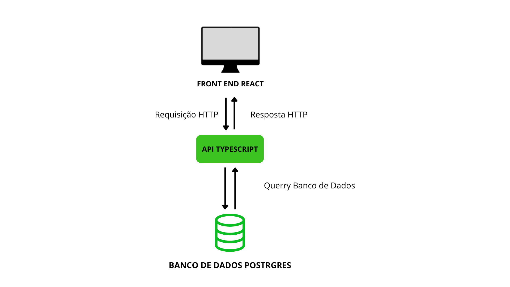

# Componentes do Projeto

O projeto é composto por três componentes:

1. O front-end em React;
2. A API em TypeScript;
3. O banco de dados PostgreSQL.

O front-end faz requisições HTTP para a API em TypeScript. A API, desenvolvida em Node.js, gerencia a lógica de negócios e fornece os dados para o front-end. Quando uma requisição é feita pelo front-end, a API consulta o banco de dados, que responde à API, que então retorna os dados ao front-end. A estrutura pode ser vista na Figura 1.

## Ansible

O Ansible possui um playbook chamado `playbook.yml` que inicialmente verifica se o Docker e o Docker Compose estão instalados. Se eles estiverem instalados, ele então cria os containers, registra e imprime logs do processo de criação dos containers para captar possíveis erros.

Além do playbook descrito acima, existe outro playbook chamado `playbook.down.yml`, que também realiza verificações para saber se o Docker e o Docker Compose estão instalados e registra logs. Porém, este, ao invés de executar o Docker Compose, tem por objetivo parar a execução do Docker Compose.

## Docker

O projeto organiza os containers Docker utilizando Docker Compose em um arquivo chamado `docker-compose.prod.yml` e dois Dockerfile, `Dockerfile.api` e `Dockerfile.front`. O Compose, além de gerenciar os containers e a ordem em que devem ser executados, gerencia as redes, endereços IP, portas, volumes e variáveis de ambiente.

A API e o banco de dados estão na rede chamada `rede_banco`, com o endereço 172.16.2.0/24. A API é exposta na porta 4000, enquanto o banco de dados Postgres roda na porta 5432. O front-end está na rede chamada `rede_front`, com o endereço 172.16.1.0/24, e aguarda requisições na porta 80 configurada com Nginx.

Tanto o front-end quanto a API possuem um Dockerfile próprio para a instalação das tecnologias e pacotes necessários para a execução das aplicações nos containers.

## Como Executar

Para executar os playbooks é preciso estar na pasta `ansible`. Para entrar nesta pasta, a partir da pasta raiz do projeto, deve-se executar o comando `cd ansible`. A partir daí, para executar os containers com as aplicações é necessário executar o playbook com o ansible com o comando `ansible-playbook playbook.yml`. Para derrubar os containers, basta executar o comando `ansible-playbook playbook.down.yml` e os containers serão derrubados.
